# Copliot Agent 개발 실습 가이드

## Copilot Studio 로그인 
https://copilotstudio.microsoft.com/

아래 가이드에 따라 작업 합니다.  
중간에 가끔 저장해 주세요.   
  

## 에이젼트 생성 및 공통 지침 작성
### 에이젼트 생성  
좌측 메뉴에서 'Agents' 아이콘 선택 후 'New Agent' 클릭합니다.    
    

에이젼트명을 '멤버실서비스 기획 프로젝트'로 지정합니다.    

이는 Claude Code에서 새로운 프로젝트 디렉토리를 만드는것과 동일합니다.  

## 공통 지침 작성
- 기존 공통 지침 붙여넣기  
  Instructions에 멤버십 서비스 디렉토리(`~/workspace/membership`)의 `AGENTS.md`의 내용을   
  복사-붙여넣기 합니다.    
  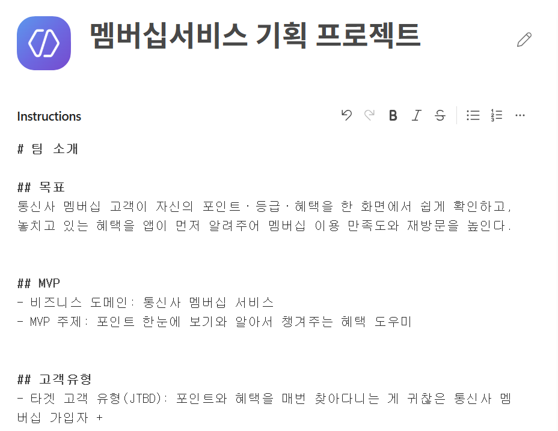   
    
- Copilot Agent에 맞게 내용 수정   
  - 일괄 수정

    | 현재 | 수정 |
    | --- | --- |
    | `references/prompt-guide.md` | Knowledge의 `prompt-guide.md` |
    | `references/pptx-guide.md` | Knowledge의 `pptx-guide.md` |
    | `references/xlsx-guide.md` | Knowledge의 `xlsx-guide.md` |

  - 섹션별 수정

    | 섹션 | 현재 | 수정 |
    | --- | --- | --- |
    | 팀원 위임 규칙 | 가장 적합한 팀원을 선정, Agent 도구로 위임 | 가장 적합한 팀원을 선정하여 위임 |
    | 기록 규칙 | 반복 검증된 핵심 교훈만 이 섹션(CLAUDE.md)에 승격한다 | 삭제 |

  - 섹션 삭제: 아래 섹션이 있으면 삭제 
    - 워크플로우 진행상황
    - Git 연동
    - URL링크 참조
    - 교훈목록
    - Advisor 활용 규칙
    - 환경변수
  
---

## One Drive에 산출물과 참조자료 등록
- hands-on 폴더 생성 후 하위에 membership 과 references 디렉토리 생성  
  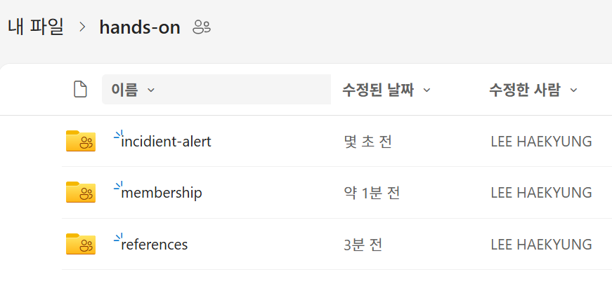  

- 산출물 등록: membership 디렉토리 하위에 `~/workspace/membership/plan` 디렉토리 업로드 
- 참조자료 등록: references 디렉토리 하위에 `~/workspace/references/` 하위 파일들 모두 업로드  

---

## 모델 선택  
Claude Opus4.8을 선택합니다.   
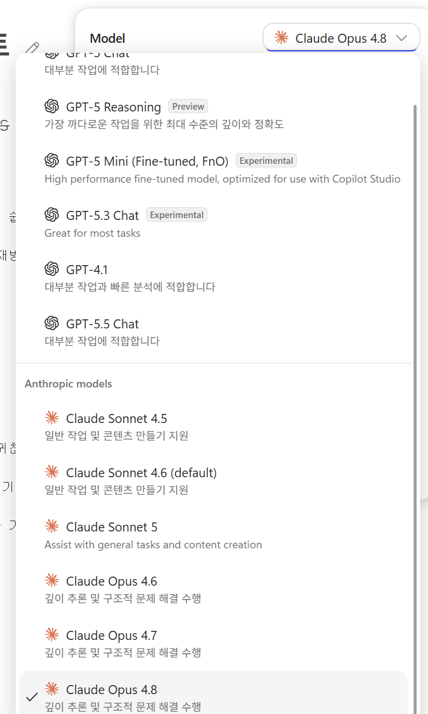   
  
---

## Knowledge에 가이드 등록  
One Drive의 `hands-on/membership/plan`과 `hands-on/references` 폴더를 등록합니다.    
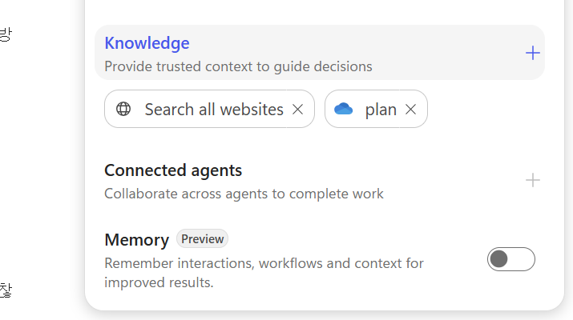    
    
    
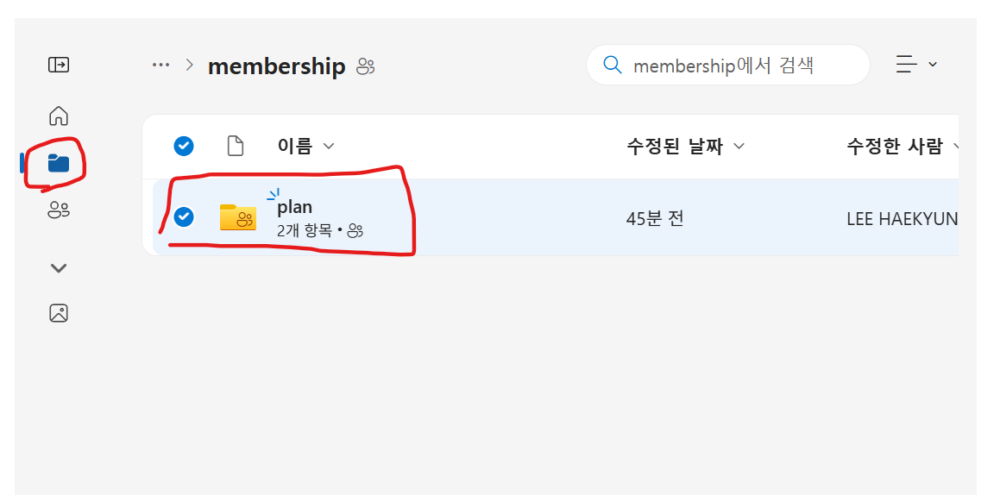    
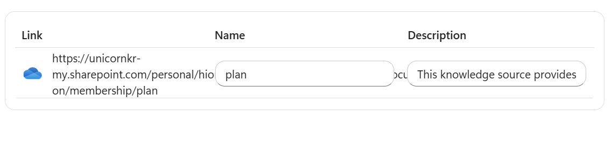  
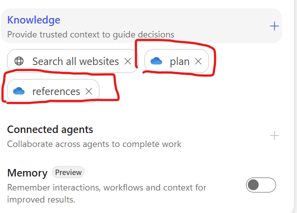   

--- 

## Skill 등록   

    

`~/workspace/membership/.claude/skills/prd-writer/SKILL.md` 파일을 업로드 합니다.    
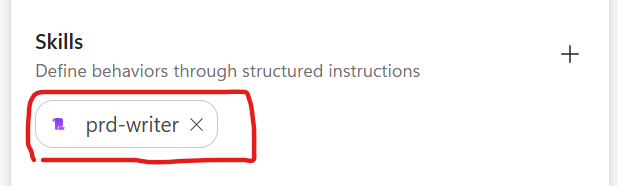   

---

## Tools 등록  
One Drive 툴을 등록합니다.    
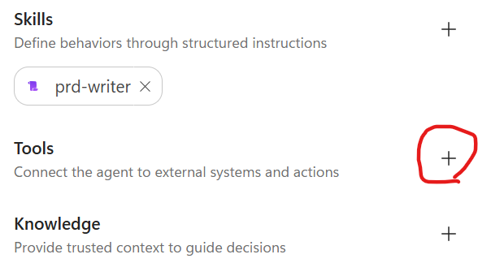   

아래 이미지에 있는 도구들을 추가합니다.   
      
  
## 인삿말과 추천 프롬프트 등록 
'Settings'를 클릭합니다.   
    

인삿말과 추천 프롬프트를 등록합니다.   
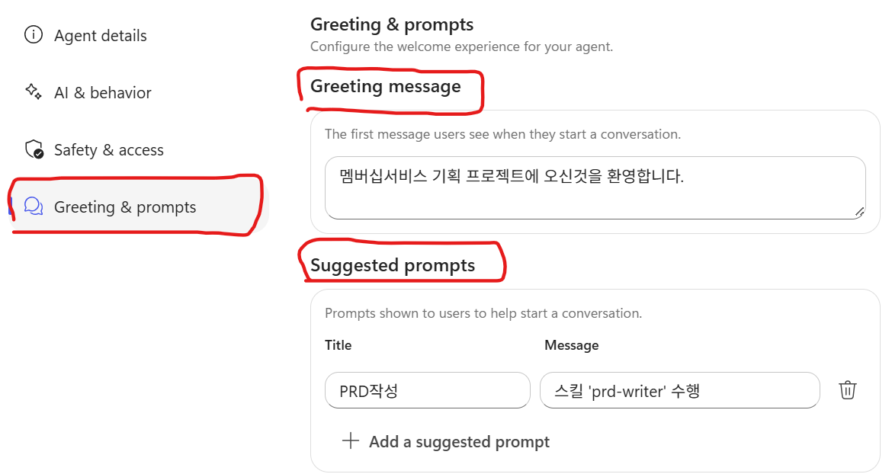  

## 배포(Publish)

### 최초 배포 
최초 1회 배포를 해야 추가 옵션을 설정할 수 있습니다.   
      

### 추가 옵션 설정
'Publish' 우측의 화살표를 클릭합니다.   
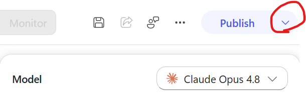    

- Copilot에서 사용할 수 있도록 체크  
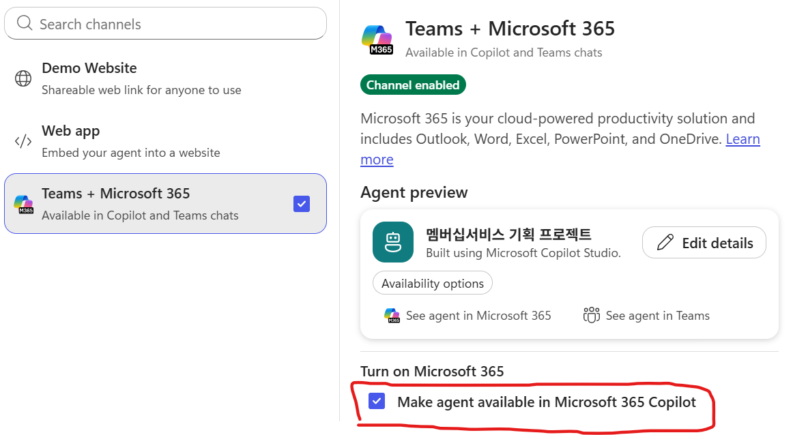    

- 상세 설정 클릭   
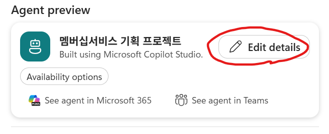     

  - 색깔, 아이콘, 짧은 설명, 긴 설명 
  　 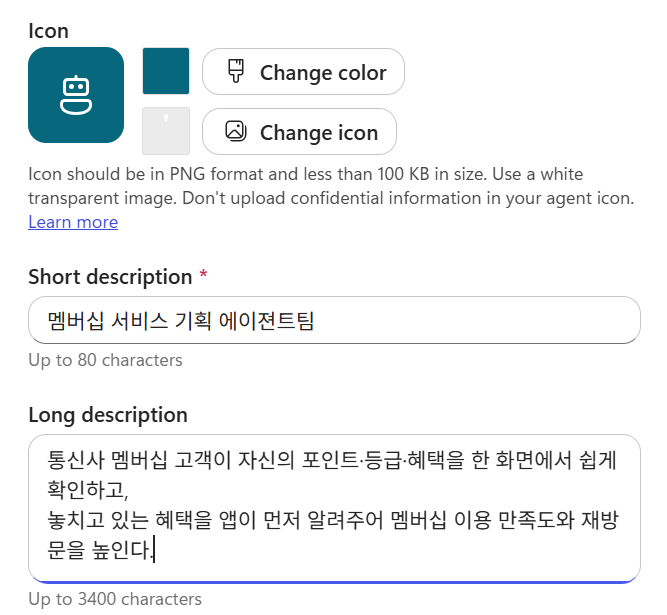　　　　
  - Teams에서 사용할 수 있도록 체크
       
  - 개발자 명 입력  
         

  - 반드시 아래로 내려 Save 클릭    
    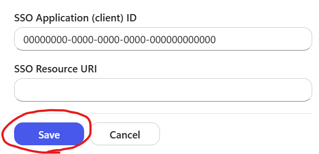   

- 제일 상단에서 이전으로 가기 클릭    

### 재배포 

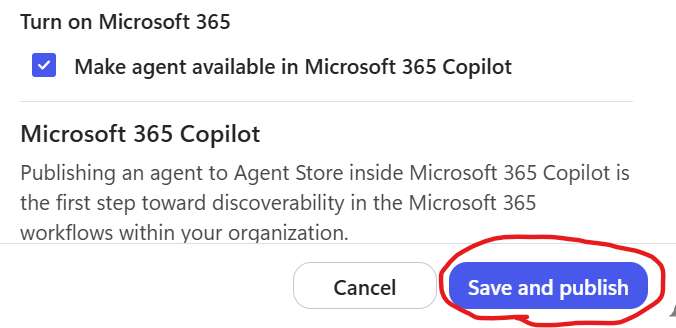   

---

## Copilot/Teams에 추가 테스트    
각 링크를 눌러 추가합니다.   
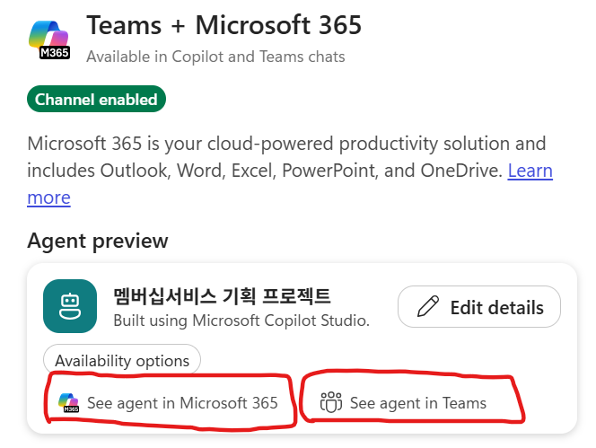   

이 링크는 Share버튼에서도 구할 수 있습니다.  
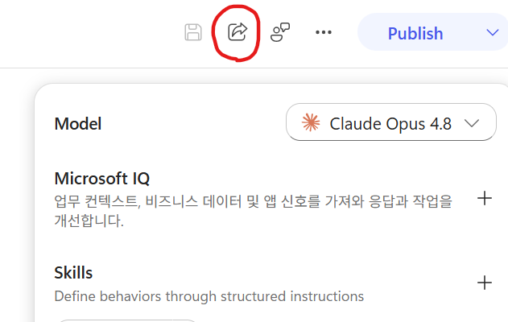     
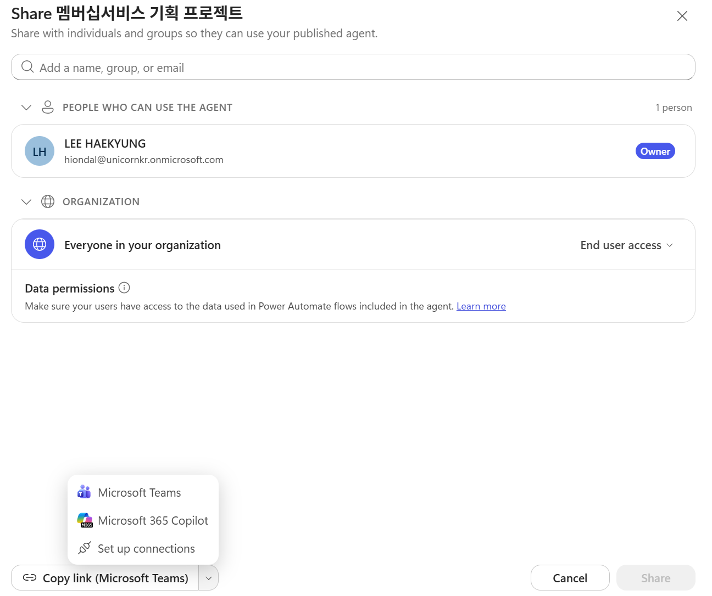   

---

## 권한 설정  
상단에서 공유 아이콘 클릭하세요.   
     

제일 상단에서 사용자, 그룹에 권한을 부여할 수 있습니다.   
지금은 모든 사용자가 접근할 수 있도록 'End user access'를 선택합니다.    
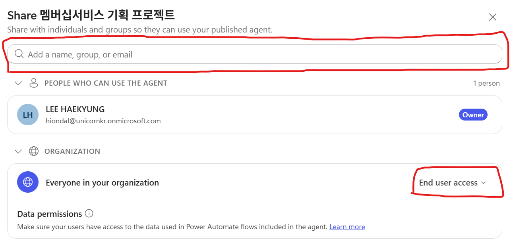    

---

## PRD 작성  
Copilot에서 PRD 작성을 수행합니다.    

