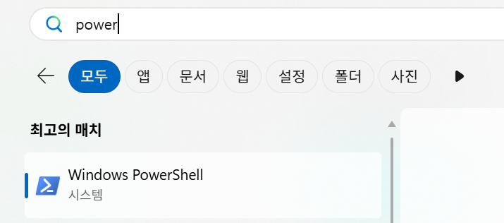

# 완료 산출물 복사 방법

이 가이드는 Claude Code를 이용한 PRD 작성 실습을 위해 샘플 완료 산출물을    
본인의 프로젝트 디렉토리에 복사하는 방법을 안내하기 위해 제작되었습니다.

## 사전작업
- 프로젝트 셋업
  프로젝트 디렉토리와 공통지침을 먼저 구성해야 합니다. -> [프로젝트 셋업 가이드](https://github.com/unicorn-campus/ai-automation/blob/main/homework/00.%ED%94%84%EB%A1%9C%EC%A0%9D%ED%8A%B8%20%EC%85%8B%EC%97%85%20%EA%B0%80%EC%9D%B4%EB%93%9C.md)

- 필수 프로그램 Claude Desktop, vscode, Git 설치: [설치 가이드](https://github.com/unicorn-plugins/npd/blob/main/resources/guides/setup/prepare.md)

## 샘플 프로젝트 다운로드
- 터미널 오픈: Windows 사용자는 PowerShell, Mac 사용자는 Terminal을 실행
      
  ※ 자주 사용하므로 작업표시줄(Mac은 Dock)에 고정하세요.  
  
- Workspace 디렉토리로 이동
  ```
  cd ~/workspace
  ```

- 샘플 저장소 다운로드
  ```
  git clone https://github.com/unicorn-campus/prd.git
  ```

- vscode에서 열기
  ```
  cd prd
  code .
  ```

## 샘플 산출물 복사  
- 멤버십 서비스 프로젝트 디렉토리 vscode에서 오픈   
  ```
  cd ~/workspace/membership
  code .
  ```
- 산출물 복사  
  다운로드한 샘플 저장소의 아래 파일을 멤버십 서비스 디렉토리로 복사

  | Phase | 소스 디렉토리 | 타겟 디렉토리 | 파일명 |
  |-------|--------------|--------------|--------|
  | 1. 문제정의 | docs/plan/define | plan/define | 시장조사.md, 문제가설.md |
  | 2. 솔루션 도출 | docs/plan/think | plan/think | 핵심솔루션.md, 비즈니스모델.md |
  | 3. 솔루션 구체화 (이벤트스토밍 결과) | docs/plan/think/es/ | plan/think/es | 하위 전체 |

  **복사방법**        
  - 멤버십 프로젝트에 디렉토리 생성: plan 디렉토리 만들고 하위에 define과 think 디렉토리 생성  
  - 소스 디렉토리에서 복사할 파일을 멀티 선택하고 복사(CTRL-C 또는 Cmd+C)   
      
  - 멤버십 프로젝트의 대상 디렉토리 선택하고 붙여넣기(CTRL-V 또는 Cmd+V)  

  ※ 디렉토리 전체를 복사할 때는 디렉토리명만 복사하고 붙여넣기 하세요.     

## 기타 문서 복사 

| 목적 | 소스 디렉토리 | 타겟 디렉토리 | 파일명 |
|-------|--------------|--------------|--------|
| PRD 작성 참조 | references | references | prd-guide.md |
| PRD 샘플 | references | references | sample-PRD-점심메뉴선택서비스.md |


